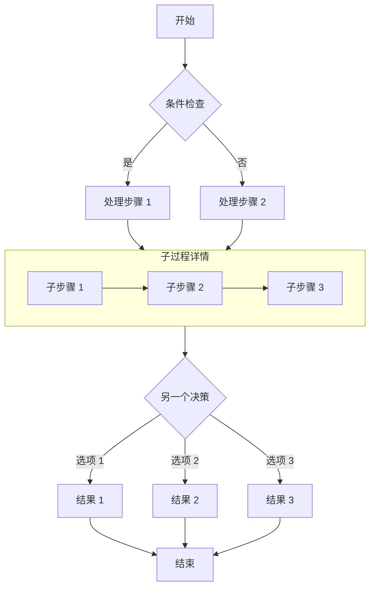

### 文章路径：`D:\TOOL\AI\claude-code\projects\blog\template\Blog\src\content`
# 第一部分 Frontmatter（元数据）
### >示例
```
---
title: 网站的markdown写文章指南
published: 2026-08-30
description: "使用markdown写文章的常用功能和示例指南"
tags: [Markdown, guide]
category: 教程
password: "114514"
---
```

# 第二部分：正文内容
## 常用语法
| 语法 | 效果 | 
| :--- | :--- | 
| `# 标题` | 一级标题 | 
| `## 标题` | 二级标题 | 
| `**加粗**` | 加粗文字 | 
| `*斜体*` | 斜体文字 |
| `- 项目` | 无序列表 | 
| `1. 项目` | 有序列表 | 
| `>正文` | 引用块 |
| `` `代码` `` | 行内代码 |
| `==正文==` | 高亮文字 |

# 第三部分：引用
## 1.图片
### >示例  
```

```
## 2.文章
### >示例  

```
[[MYblog|（自定义内容）]]
```
### >效果  
[[MYblog|自定义内容]]

# 第四部分：Mermaid 图表
### 示例
````

````

### 效果


